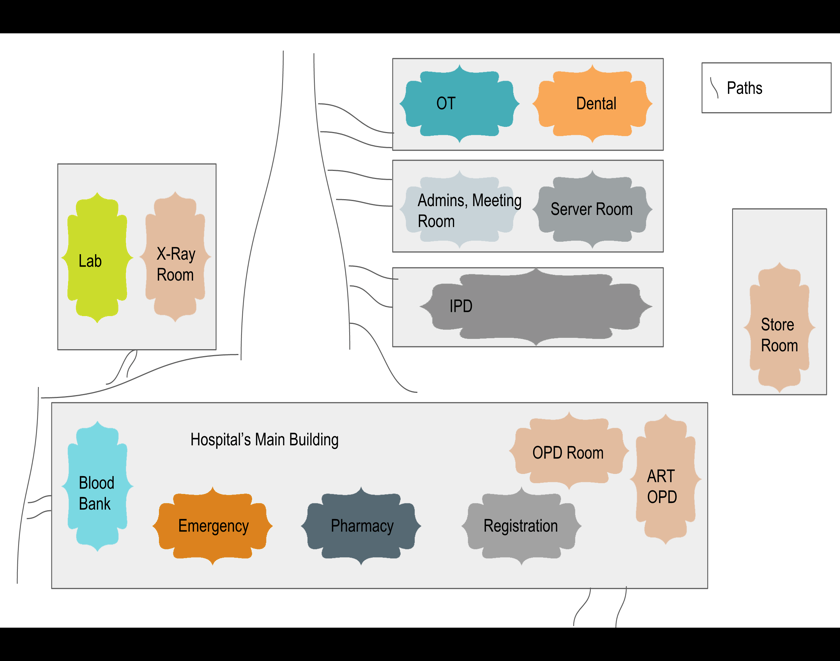
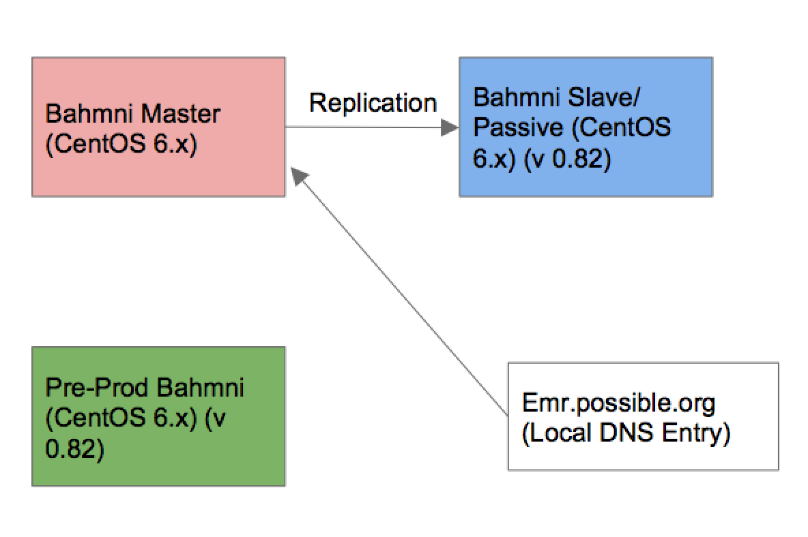

Possible Deployment Details 
---

<details>
<summary>On this page</summary>

- [Intended Audience](#intended-audience)
- [Purpose and Objective](#purpose-and-objective)
- [Abbreviations and Terminologies](#abbreviations-and-terminologies)
- [High level diagram of Possible hospital setup](#high-level-diagram-of-possible-hospital-setup)
- [Bahmni deployment setup](#bahmni-deployment-setup)
- [Extra Github Repositories](#extra-github-repositories)
- [Configurations](#configurations)
- [Backup strategy and configuration](#backup-strategy-and-configuration)
- [Monitoring setup](#monitoring-setup)
- [Contact Persons](#contact-persons)
- [Appendix and References](#appendix-and-references)

</details>


#### Intended Audience
The intended audience of this document are i) Implementation Leads and ii) Implementation Engineers who are familiar with the Bahmni.
```markdown
Readers are not required to know the architecture and modules of Bahmni.
```
#### Purpose and Objective
The purpose of this document is to give a brief overview about the Bahmni deployment and related details at Possible Bayalpata hospital.

#### Abbreviations and Terminologies
- **MRS** - Medical Record System
- **ERP**  - Enterprise Resource Planning
- **ELIS** - Enterprise Lab Information System
- **PACS** - Picture archive and communication system

#### High level diagram of Possible hospital setup
The image below depicts different rooms/buildings of the Bayalpata hospital


#### Bahmni deployment setup
At present we have 3 centos 6.7 machines dedicated for Bahmni.
  * Prod Master (xx.x.x.45)
  * Prod Slave  (xx.x.x.30)
  * Pre-Prod  (xx.x.x.40)


We have the following modules installed.

1. MRS
1. ERP
1. Elis
1. Pacs Integration

#### Extra Github Repositories
```markdown
All the repositories are kept under possible health organization in github.
https://github.com/Possiblehealth
```
```markdown
Config Repo
https://github.com/Possiblehealth/possible-config
```
```markdown
ERP Custom Modules
https://github.com/Possiblehealth/possible-erp-custom
```

List of extra ERP reports done for possible (All graphs).
* Percentage of Products in min-max level :- Show the percentage of products which are above max level, below min level or between min and max. This should be based out of location BPH Storeroom (hospital’s main stock location)
* stock out report :- Show the number of stock-outs happened in the hospital (consider all the locations), Consider only formulary drugs
* Inventory analysis report :- Running inventory analysis for a particular product.
* Sales By Supplier Category :- Show the sales by supplier category, Supplier Categories are defined on batch level.
* Purchase By Supplier Category :- Show the purchases by supplier Category.
* KPI Data sheet download option for the hospital as well as ERP shop locations in the hospital.


#### Configurations
All the configuration are put on the config repositories, and any thing else must be there in the Database.
#### Backup strategy and configuration
Backups are taken right now using a scheduled job triggered by the go-agent running in prod master. This backup is later copied to a folder in pre-prod which is synced to Dropbox. This will change with next deployment, as we are going to go with blue-green style of deployment, the DB backup should move to the shared storage or slave box. You can access the go-server at http://xx.x.x.30:8153
#### Monitoring setup
We use nagios to monitor the production boxes, nagios is installed in pre-prod box, which monitors the master and slave, and can be accessed at https://xx.x.x.30/nagios 
#### Contact Persons
* EMR:- Anant Raut <anant@possiblehealth.org>
* ERP:- Nabin Prakash Sharma <nabin@possiblehealth.org>
* Lab:- Omkar Adhikari
* Servers:- Sanjaya Poudel <sanjaya@possiblehealth.org>
* Reports Related:- Deepak Bista <dbista@possiblehealth.org>
#### Appendix and References
* http://possiblehealth.org/
* http://bahmni.atlassian.net/wiki/display/BAH/Bahmni+Home
